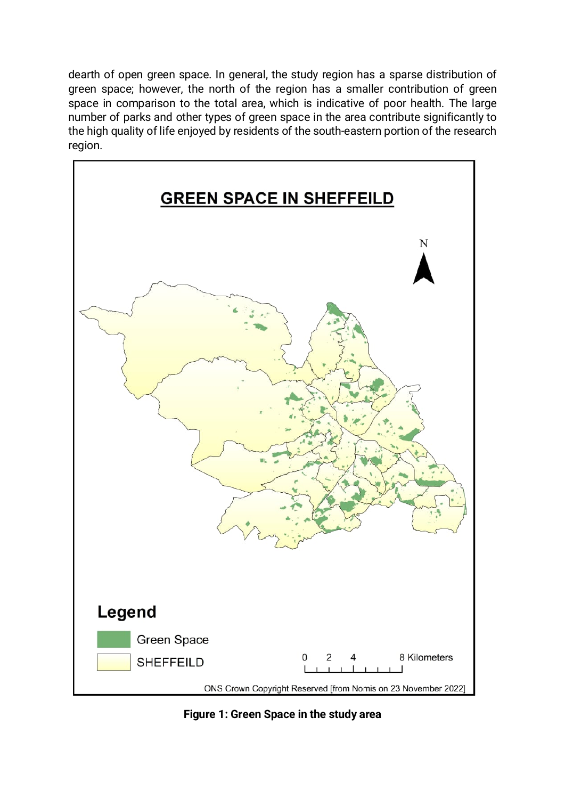

> Reconstructed archive assembled 2026-09-30. The user recalls project work beginning around March-April 2024 and continuing through December 2024. Exact daily author dates are assigned milestones, not recovered Git timestamps.

# Map reading guide

The rendered page shows the report figure for green space in the study area. The source layers and classification settings remain unavailable. This is a rendering of physical PDF page 5, not a map regenerated from source GIS data.

Read the title, legend, scale, orientation, mapped variable, and study extent before interpreting a pattern. A visually plausible output does not independently verify the input data, processing settings, or positional accuracy. A later reproduction should identify the original input layers and parameters, recreate the map, and document differences.
